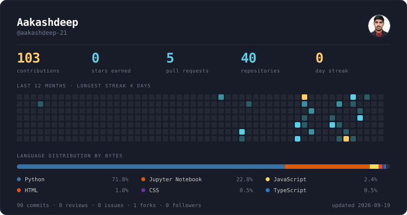

<!-- ================================================================== -->
<!--  Profile README — self-hosted stats                                -->
<!--  The stats card below is a static SVG built by GitHub Actions.     -->
<!--  Nothing here depends on a third-party server.                     -->
<!-- ================================================================== -->

# Hey, I'm YOUR_NAME 👋

**[one line about what you build]**

<!-- Auto-switches with the viewer's GitHub theme -->
<picture>
  <source media="(prefers-color-scheme: dark)" srcset="dist/stats-midnight.svg">
  <source media="(prefers-color-scheme: light)" srcset="dist/stats-daylight.svg">
  
</picture>

---

## What I'm working on

- 🔭 **[Project name]** — [one line on what it does]
- 🌱 Currently digging into **[technology]**
- 💬 Happy to talk about **[your areas]**

---

## Tools I reach for

---

## Selected work

| Project | What it is | Stack |
| --- | --- | --- |
| **[repo-one](https://github.com/YOUR_USERNAME/repo-one)** | [one line] | TypeScript, Postgres |
| **[repo-two](https://github.com/YOUR_USERNAME/repo-two)** | [one line] | Go, Redis |
| **[repo-three](https://github.com/YOUR_USERNAME/repo-three)** | [one line] | Python |

---

## Elsewhere

Stats card regenerates daily via GitHub Actions — no external services involved.
